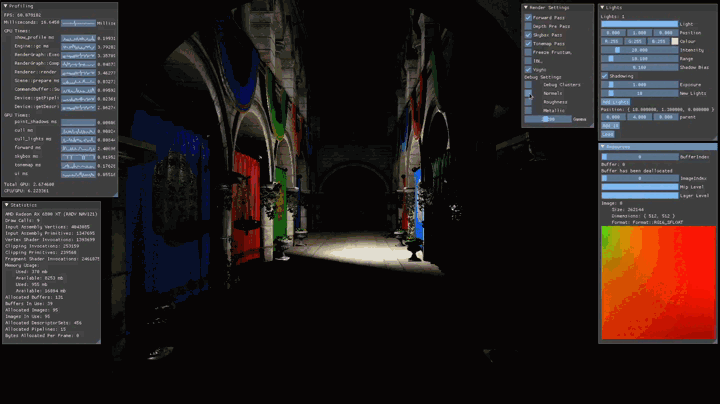
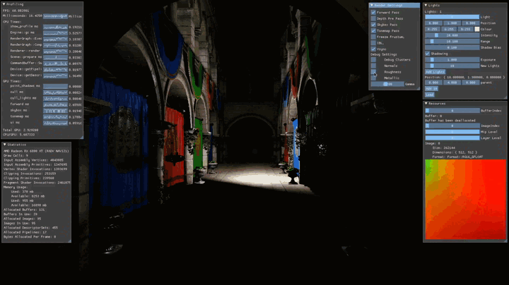
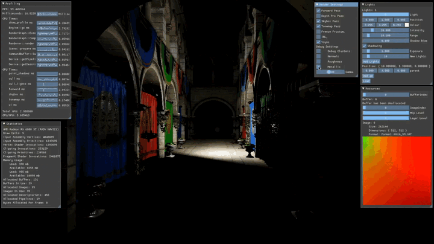

# Cala

### Rendering engine written in C++ using the Vulkan API.

Cala is the Quenya word for light so this project is a simulatio of light.

### Features:
- [x] Linux support
- [x] GPU Driven Rendering
- [x] Rudimentary Render Graph
- [x] Cook Torrence PBR
- [x] Point Lights with shadows
- [x] Clustered forward shading
- [x] Debug views (normal, roughness, metallic)
- [x] shader reflection and hot reloading
- [x] bindless images/buffers

##### Clustered Forward Lighting
Compute shaders used to divide view frustum into buckets which are then used to sort lights in the scene according to world position.

##### Dynamic Lights
Light positions, colour, intensity and range are all variable at runtime.

##### Normal Debug View
Option to view mesh normals

##### Roughness Debug View
Option to view material roughness

##### Metallic Debug View
Option to view material metallicness

##### Clustered Debug View
Option to view density of lights per cluster. Green is low density, yellow is medium density, red is high density. 

##### CPU + GPU Profiler
Use PROFILE_NAMED() macro to enable profilig of a function. GPU timers are automatically inserted into rendergraph between each renderpass

### Dependencies
##### system library
- SDL2 - windowing system
- assimp

##### git submodules
- spirv-cross - spirv reflection
- spirv-headers
- spirv-tools
- glslang
- shaderc - glsl compilation
- Ende - some common functionality
- fastgltf - gltf loader
- imgui - gui
- implot - nice plots for gui
- node_editor - create graphs in gui

##### source included
- stb_image - image loader
- vma - vulkan memory allocator
- nlohmann json - json parser
- tsl - robin hash map